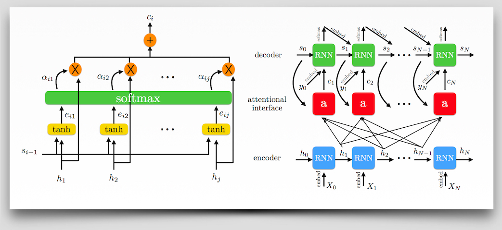

## Interpretability via Attentional and Memory-based Interfaces Using TensorFlow
#### A closer look at the reasoning inside your deep networks.

**TLDR:** This post will serve as a gentle introduction to attentional and memory-based interfaces in deep neural architectures using TensorFlow. Incorporation of attention mechanisms is very simple and can improve transparency interpretability in our complex models. We will conclude with extensions and caveats of the interfaces.



**Note:** This code has been written for TensorFlow v1.0.0

Before running the Jupyter notebook [attention.ipynb](attention.ipynb), you'll need to ensure that your machine is set up to run TensorFlow and install a handful of helpful additional libraries.

### Setup
1. Download [this entire repo from GitHub](https://github.com/ajarai/O-Reilly)

2. Open your terminal and use `cd` to navigate into the top directory of the repo on your machine

3. Unzip the processed reviews data by entering
```bash
unzip ./attention/processed_reviews.zip
```

Now, set up your environment by using the Dockerfile included with this repo (option A) or configuring it manually (option B).

#### Option A: use the Dockerfile configured for this notebook
(Note: For GPU versions, etc. check out [TensorFlow's Docker repo](https://github.com/tensorflow/tensorflow/tree/master/tensorflow/tools/docker).)

4. After downloading this repo to your machine, open your terminal and use `cd` to navigate to the directory that contains `Dockerfile.cpu`.

5. To build the Dockerfile, enter
```bash
docker build -t dockerfile_cpu -f dockerfile.cpu .
```
If you get a permissions error on running this command, you may need to run it with `sudo`:
```bash
sudo  build -t dockerfile_cpu -f dockerfile.cpu .
```

6. Run Docker from the Dockerfile you've just built
```bash
docker run -it -p 8888:8888 -p 6006:6006 dockerfile_cpu bash
```
or
```bash
sudo docker run -it -p 8888:8888 -p 6006:6006 dockerfile_cpu bash
```
if you run into permission problems.

7. Launch Jupyter by entering
```bash
jupyter notebook
```
and, using your browser, navigate to the URL shown in the terminal output (usually http://localhost:8888/)

#### Option B: set up environment manually on local machine
For instructions on installing TensorFlow, please see [TensorFlow's platform-specific installation instructions](https://www.tensorflow.org/install/).
```bash
Required:
python 3.3+
pip 9.0.1 (sudo easy_install pip)
virtualenv (pip install virtualenv)
Optional: CUDA enabled GPU (explicity define cpu components (embedding, etc.)
```

4. Enter the `attention` directory in your terminal and enter the following commands
```bash
make venv
source oreilly-attention-venv/bin/activate
make load-data
ipython3 notebook attention
```
5. Launch Jupyter by entering
```bash
jupyter notebook
```
and, using your browser, navigate to the URL shown in the terminal output (usually http://localhost:8888/)


### Contact:
Goku Mohandas
* Twitter: [@GokuMohandas](https://twitter.com/gokumohandas)
* Github: [ajarai](https://github.com/ajarai)
* Blog: [The Neural Perspective](http://www.theneuralperspective.com)
* Linkedin: [Goku Mohandas](https://www.linkedin.com/in/gokumd)

### Author Bio:
Goku Mohandas is an artificial intelligence (AI) researcher in Silicon Valley with a focus on using deep learning for natural language tasks. His interests include research on AI for intelligent search and question answering augmented by attentional and memory-based interfaces. He also strongly believes in the democratization of AI with a focus on interpretability and transparency. Previous work includes working on the intersection of AI and biotechnology at the Johns Hopkins University Applied Physics Laboratory.
